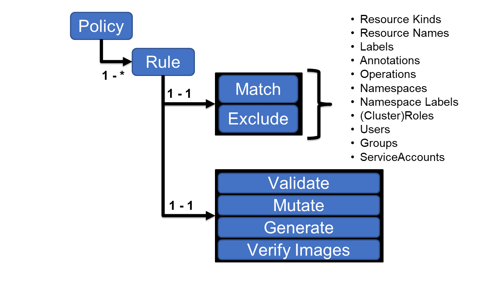

### Kyverno
#### A Kyverno policy is a collection of rules. Each rule consists of a match declaration, an optional exclude declaration, and one of a validate, mutate, generate, or verifyImages declaration. Each rule can contain only a single validate, mutate, generate, or verifyImages child declaration.
#### Policies can be defined as cluster-wide resources (using the kind ClusterPolicy) or namespaced resources (using the kind Policy.) As expected, namespaced policies will only apply to resources within the namespace in which they are defined while cluster-wide policies are applied to matching resources across all namespaces. Otherwise, there is no difference between the two types.

#### Validation is the most common use case for policy and functions as a “yes” or “no” decision making process. Resources which are compliant with the policy are allowed to pass (“yes, this is allowed”) and those which are not compliant may not be allowed to pass (“no, this is not allowed”). An additional effect of these validate policies is to produce Policy Reports. A Policy Report is a custom Kubernetes resource, produced and managed by Kyverno, which shows the results of policy decisions upon allowed resources in a user-friendly way

- [Validation](validation/README.md)

#### Mutation is the ability to change or “mutate” a resource in some way prior to it being admitted into the cluster. A mutate rule is similar to a validate rule in that it selects some type of resource (like Pods or ConfigMaps) and defines what the desired state should look like.

- [Mutation](mutation/README.md)

#### Kyverno has the ability to generate (i.e., create) a new Kubernetes resource based upon a definition stored in a policy. Like both validate and mutate rules, Kyverno generate rules use similar concepts and structures to express policy. The generation ability is both powerful and flexible with one of its most useful aspects being, in addition to the initial generation, it has the ability to continually synchronize the resources it has generated. Generate rules can be a powerful automation tool and can solve many common challenges faced by Kubernetes operators
- [Generation](generation/README.md)
